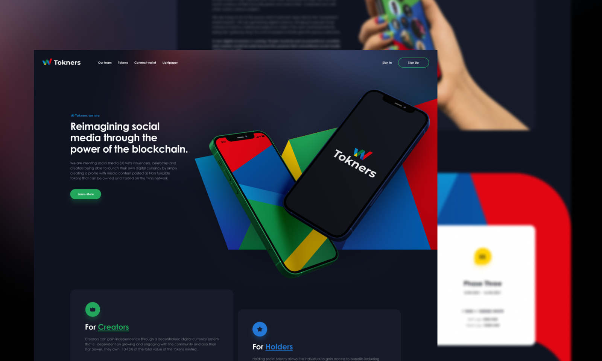

# :iphone: Tokners

<div align="center">
    
</div>

---

## :bookmark_tabs: Sobre

- Esse projeto é um UI Clone de um layout do [Figma](https://www.figma.com/community/file/967487413129522712), com o intuito de aprimorar o conhecimento em CSS, utilizando novos conceitos de layout, responsividade, pré-processadores (SASS) e principalmente fidelidade com as telas propostas.

---

## :art: Layout

- [Figma](https://www.figma.com/community/file/967487413129522712)

---

## :gear: Techs

- [HTML](https://developer.mozilla.org/pt-BR/docs/Web/HTML)
- [CSS](https://developer.mozilla.org/pt-BR/docs/Web/CSS)
- [SASS](https://sass-lang.com/)

---

## :desktop_computer: Como usar


<br />

<p> Instalação das dependências: </p>

```
    yarn install
```

<p> Após isso, é necessário apenas abrir o arquivo index.html</p>
## :books: License

Arquivos sob a licença [MIT](https://github.com/lucasgomesgp) criado por Lucas Gomes.